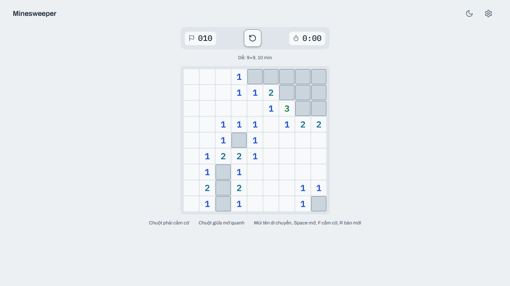

# 💣 Duck Mines — the original rules, readable in the dark, playable from the keyboard

[](https://github.com/LeVanAnhDuc/web-game-duck-mines/actions/workflows/ci.yml)
[](https://github.com/LeVanAnhDuc/web-game-duck-mines/actions/workflows/deploy.yml)
[](https://github.com/LeVanAnhDuc/web-game-duck-mines/releases)

A Minesweeper clone built with Next.js and plain DOM. No server, no sign-in, no
analytics: it exports to static HTML and everything happens in your browser.

**Play**: https://levananhduc.github.io/web-game-duck-mines/



## Features

- **The game itself**

  - The first click is always safe, and always opens a region — the mines are placed
    after you click, never in the 3×3 around it
  - Chording works: with the right number of flags around an open number, one click
    opens the rest — and it explodes if a flag is in the wrong place, exactly as the
    original does
  - Flags protect a cell, so a stray click cannot cost you the board
  - The mine counter goes negative rather than stopping at zero: a negative number
    tells you a flag is certainly misplaced
  - Losing shows every mine, marks the one that went off, and slashes the flags you
    put in the wrong places
  - The clock starts on your first move, not when the page loads, and does not stop
    at 999 — that was a three-digit LED, not a rule

- **Readable in the dark, and without colour**

  - The eight numerals run as a heat ramp: blue for the quiet counts, through green
    and amber, to red and a violet 8 that means you are in trouble
  - Every numeral clears 4.5:1 contrast in both light and dark mode — measured by
    the test suite on every run, not measured once by hand
  - The digit carries the information and colour only reinforces it, so the board
    still reads in grayscale
  - Open and closed cells are told apart by shape — a closed cell is a bordered
    tile, an open one is flat — because lightness alone cannot carry that difference
    and keep the numerals legible

- **Three boards, or one you build yourself**

  - Beginner 9×9, Intermediate 16×16, Expert 30×16 — the original presets, each with
    its own best time
  - Or set your own columns, rows and mines. The mine field is capped as you type, not
    when you press start: the opening move always clears its own cell and the eight
    around it, so nine cells can never hold a mine
  - A board you built is fully playable and **never ranked** — the record table stays
    three rows, and the screen says so before your first move rather than after a win
  - Changing board mid-game asks first, and only once the clock is actually running

- **Dark mode that follows you, or does not**

  - Light, dark, or whatever the system is doing — and "system" really means system,
    so changing your OS theme with the tab open changes the page
  - The choice is remembered

- **One sound, and it is off**

  - The mine going off, generated in code — the game ships no audio file at all
  - Off by default, on from settings. A game played on a bus should not make noise
    nobody asked for

- **Built for a thumb**

  - Tap to open. Hold to aim: the target lifts above your finger, sliding moves it,
    and lifting off the board cancels — so a mis-tap is corrected before it becomes a
    move
  - Keep holding to flag, without lifting
  - Or switch the bottom bar to Flag and tap
  - A board bigger than the screen pans inside its own frame; the page itself never
    scrolls sideways, so the mine counter and the new-game button stay put
  - If turning the phone would fit the whole board, it says so once

- **Playable without a mouse**

  - Arrow keys move, `Space` opens, `F` flags, `Enter` chords, `R` starts over
  - One tab stop for the whole board, and the focus ring is always visible
  - Every cell announces its position and state to a screen reader
  - Right click flags, middle click chords, and the browser menu stays out of the way

- **Nothing to install, nothing to sign into**

  - Static export, so it runs from any file host
  - `?seed=` gives you a specific board, so two people can play the same one
  - No account, no analytics, no cookie: nothing about you leaves your device

## Controls

Mouse and keyboard are both complete: the whole board is playable without a pointer,
which is the point of the labelled cells and the visible focus ring.

| Action | Mouse | Keyboard |
| ------ | ----- | -------- |
| Open a cell | Left click | `Space` |
| Flag a cell | Right click | `F` |
| Chord — open every neighbour of a satisfied number | Middle click | — |
| Move | — | `↑` `↓` `←` `→` |
| New board | The reset button | `R` |

The first click is always safe: mines are laid **after** it, never under it.

## Commands

```bash
yarn install
yarn dev          # http://localhost:3000
yarn test         # unit + component tests
yarn test:e2e     # Playwright, against the static export in out/
yarn typecheck
yarn lint
yarn build        # writes out/
```

`yarn test:e2e` needs a build first (`yarn build`) and a Chromium install
(`npx playwright install chromium`).

Two checks enforce thresholds that would otherwise only be written down:

```bash
yarn check:bundle   # NFR-PERF-07: first-load JS, measured from the exported HTML
yarn check:audit    # NFR-SEC-05: fails on high/critical advisories only
```

## How it is put together

```
src/
  game/core/      the rules as pure functions — board, reveal, mark, custom, reducer
  game/input/     keyboard and pointer, both producing the same actions
  game/score/     records per difficulty, behind a repository interface
  game/settings/  persisted preferences
  game/storage/   a localStorage wrapper that survives private mode
  game/audio/     WebAudio, synthesised, no files
  views/Home/     the DOM board and the surrounding UI
```

`src/game/` never imports React — `purity.test.ts` asserts it. That is why the rules
can be tested by calling them, with no board rendered and no browser started, and it
is why the same rules could later drive a different renderer without being rewritten.

The board is **plain DOM, not canvas**, unlike the other games here. A minefield is a
grid of labelled buttons, and the browser already knows how to focus, announce and
tab through those. Drawing it on a canvas would have meant rebuilding all of that by
hand and getting it slightly wrong.

## What runs on GitHub

| Workflow | When | What it does |
| --- | --- | --- |
| `ci.yml` | every pull request and push to `main` | Two parallel jobs: lint + typecheck + unit tests + dependency audit, and build + first-load-JS budget + the end-to-end suite at four viewports |
| `deploy.yml` | push to `main` | Rebuilds with `GITHUB_PAGES=true` and publishes `out/` to GitHub Pages. It re-runs the tests rather than trusting a green run it cannot see |
| `release.yml` | push to `main` | Works out the next version, composes the notes, and publishes a GitHub release |

## Releases and versioning

Version numbers and release notes are **derived from the commit history**, so neither
depends on anyone remembering to do something. Both live in scripts you can run
locally — a release process you can only exercise by pushing to `main` is one nobody
exercises:

```bash
yarn release:next            # which tag the next release would get, and why
yarn release:notes v1.1.0    # what its notes would say
```

**How the version is decided**, against the previous `v*` tag:

| Since the last tag | Bump |
| --- | --- |
| a commit marked `feat!:` / `fix!:` …, or a `BREAKING CHANGE:` body | major |
| any `feat:` commit | minor |
| anything else | patch |

The head commit's **subject** can override it: `[release major]`, `[release minor]`,
or `[skip release]` to publish nothing. Only the subject counts — a body that merely
mentions the marker (this README, for one) must not trigger a release.

**How the notes are composed:** commit subjects since the previous tag, grouped by
their Conventional Commit prefix — breaking changes first, then What's new (`feat`),
Fixes (`fix`), Performance, Internals, Tests, Documentation, Build and tooling.
Scopes are kept as labels, so `feat(core-game): …` reads as **core-game**: …

Commits that are not Conventional Commits land under "Other" rather than being
dropped. A release note that swallows commits is a release note that has started
lying.

GitHub's own `--generate-notes` is not used: it groups by pull-request label, and
this repository does not label its PRs. What it does have is a conventional subject
on every commit. See [ADR-0006](docs/decisions/0006-releases-derived-from-commits.md).

## Keeping this README honest

`## Features` is the user-facing contract, so it changes in the **same branch** as the
code that changes behaviour — never in a catch-up pass afterwards:

- a `feat:` that a player would notice gets **one short bullet**, in English, in the
  existing voice: what the player can now do, not which component was added
- a bullet describes behaviour that exists **today**. Nothing here is aspirational —
  if it is in this list, it works
- a change that only a developer would notice (refactor, tooling, tests) does **not**
  belong in `## Features`
- a README-only change is a `docs:` commit and, on its own, releases a patch

## Documentation

`docs/README.md` is the map. In short:

| Question | File |
| --- | --- |
| What is this, and what will it never do? | `docs/01-product/overview.md` |
| What can the player do? | `docs/02-requirements/scope.md` |
| What thresholds apply everywhere? | `docs/02-requirements/nfr.md` |
| What breaks silently if I change it? | `docs/03-design/invariants.md` |
| Why is it built this way? | `docs/decisions/` |
