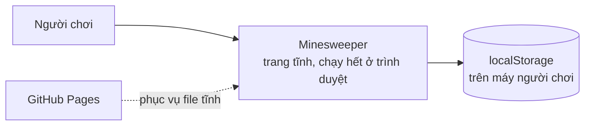
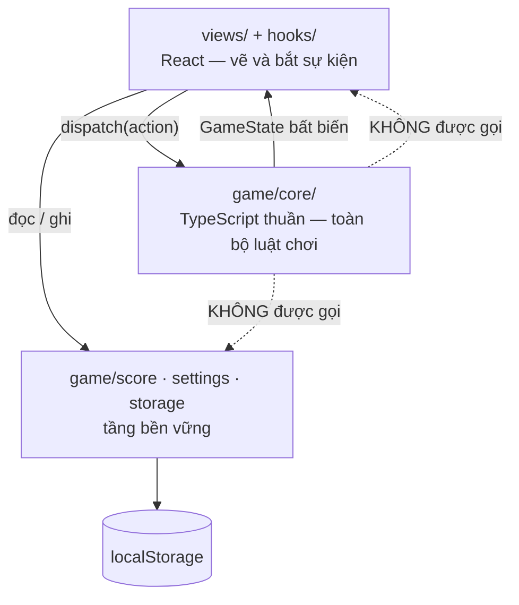

# Kiến trúc

> **Trả lời:** Hệ thống ghép lại thế nào, ranh giới giữa các phần ở đâu?
> **Trạng thái:** 🟢 đủ
> **Cập nhật:** 2026-09-03 · commit —
> **Cập nhật khi:** thêm/bỏ một module hoặc service · đổi cách hai module nói chuyện

<!-- CÁCH ĐIỀN
Mức độ: C4 mức 1 (context) và mức 2 (container). KHÔNG đi xuống class hay function —
đó là code, và code là bản mô tả chính xác nhất của chính nó.

Mục 3 (ranh giới module) là mục AI dùng nhiều nhất: nó quyết định code mới nên đặt
ở đâu. Viết mỗi module một dòng: tên · trách nhiệm một câu · được phép gọi ai.

Mục 5 chỉ ghi TÊN công nghệ + số ADR. LÝ DO chọn nằm trong ADR, không nằm đây —
nếu lý do bị chép vào đây thì hai bản sẽ lệch.

KHÔNG chứa: lý do chọn công nghệ (-> decisions/), bất biến (-> invariants.md),
schema chi tiết (-> file schema của ORM), danh sách chức năng (-> 02-requirements/scope.md).
-->

## 1. Context — hệ thống nằm giữa ai với ai

**Không có gì khác.** Không server ứng dụng, không database, không API, không dịch vụ
ngoài, không analytics. Sau khi tải xong trang, hệ thống **không gọi mạng lần nào nữa**
(`NFR-REL-04`). Mọi ràng buộc kiến trúc trong file này đều xuất phát từ trần chi phí 0₫
ở [`overview.md`](../01-product/overview.md) §5.

## 2. Container — hệ thống gồm những khối chạy được nào

Đúng **một** khối chạy được: bundle tĩnh trong trình duyệt. Bên trong nó, ba tầng, và
mũi tên chỉ đi một chiều xuống:

`core/` là đáy: nó không gọi lên, không gọi ngang, không biết React và không biết
`localStorage` tồn tại. Đó là bất biến #1 ở [`invariants.md`](invariants.md).

## 3. Module và ranh giới

| Module | Trách nhiệm một câu | Được phép gọi | **Không** được gọi |
| --- | --- | --- | --- |
| `game/core/` | Toàn bộ luật chơi, dưới dạng hàm thuần và một reducer thuần | chỉ `game/core/` | React · DOM · `localStorage` · `Date.now()` · `Math.random()` |
| `game/core/rng.ts` | Nguồn random duy nhất của dự án, có seed | — | `Math.random()` |
| `game/score/` | Đọc/ghi kỷ lục theo độ khó, sau một interface | `game/storage/` | `game/core/` · React |
| `game/settings/` | Đọc/ghi độ khó, theme, bật/tắt dấu hỏi | `game/storage/` | `game/core/` · React |
| `game/storage/safeStorage.ts` | Bọc `localStorage`, trả `null` thay vì ném | `localStorage` | mọi thứ khác |
| `hooks/` | Nối reducer với thời gian thật và với tầng bền vững — nơi **duy nhất** có side effect | `game/**` · React | `views/` |
| `views/` | Vẽ `GameState`, phát `action`. Không chứa luật chơi | `hooks/` · `game/core/types` | `game/score` · `game/settings` · `game/storage` trực tiếp |
| `app/` | Vỏ Next.js: layout, `globals.css` (token), một route | `views/` | `game/**` |

**Quy tắc đặt code mới:** hỏi "hàm này có cần biết hôm nay là ngày nào, hoặc màn hình
rộng bao nhiêu, hoặc người dùng đã lưu gì không?" — Không thì nó thuộc `core/`. Có thì
nó thuộc `hooks/` hoặc `views/`.

## 4. Luồng dữ liệu của đường đi quan trọng nhất

**Một nước đi.** Đây là luồng mà mọi thứ khác đi theo:

1. Người chơi bấm một ô → `views/Home/mains/Board/Cell.tsx` phát
   `dispatch({ type: "reveal", row, col })`.
2. `useGame` chuyển thẳng action vào reducer. Nó **không** xử lý gì trước.
3. `core/reducer.ts` chạy thuần: nếu đây là nước đầu thì gọi `plantMines(seed, exclude)`
   trước, rồi `reveal()` lan vùng, rồi `checkWin()`. Trả về một `GameState` **mới**.
4. React nhận `GameState` mới. Chỉ những `Cell` có ô đổi mới vẽ lại — nhờ `memo` và
   prop nguyên thuỷ (bất biến #4).
5. Nếu `status` vừa chuyển sang `won`, `useGame` — **không phải reducer** — gọi
   `scoreRepository.saveIfBest(difficulty, seconds)`.

Đồng hồ **không** đi qua luồng này. `useTimer` tự tick và chỉ component `Timer` vẽ lại;
reducer chỉ giữ mốc `startedAt` (bất biến #3).

**Nhánh lỗi duy nhất:** `safeStorage` trả `null` → kỷ lục không lưu, UI nói rõ một
dòng, game chạy tiếp bình thường (`NFR-REL-03`). Không có nhánh lỗi mạng, vì không có
mạng.

## 5. Tech stack

| Lớp | Công nghệ | Biện minh |
| --- | --- | --- |
| Framework | Next.js 15 (App Router), `output: "export"` | tiền lệ `web-game-flappy-bird` cùng workspace |
| Ngôn ngữ | TypeScript | — |
| Vẽ bàn cờ | DOM (`<button>` mỗi ô) + CSS Grid, **không Canvas** | ADR-0002 |
| Style | Tailwind CSS + CSS variables cho token | [ADR-0001](../decisions/0001-design-tokens.md) |
| Icon | `lucide-react` | [ADR-0001](../decisions/0001-design-tokens.md) |
| Test đơn vị | Vitest (không cần jsdom cho `core/`) | — |
| Test e2e | Playwright | — |
| Bền vững | `localStorage` | `NFR-DATA-04` |
| Host | GitHub Pages | [`overview.md`](../01-product/overview.md) §5 |

Font `Archivo` + `IBM Plex Mono` tải từ Google Fonts — **ngoại lệ duy nhất** của
"không gọi mạng sau khi tải trang", và chỉ ở lần tải đầu. Fallback hệ thống đã khai
trong `MASTER.md` nên font chưa về không làm bàn nhảy layout.
